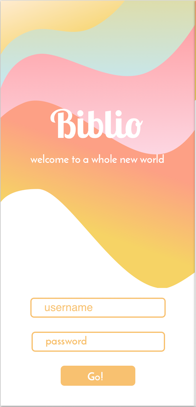

# Biblio

## By Jessica Schmitz

# Description
This is a digital bookshelf that helps the user track books they have read and plan to read. Will be mad using React at a later date.

# This is Biblio

# Specifications
* The program will hold the necessary files and folders for easy cloning
  * Input Example: **Example**
  * Output Example: **Example**

# Setup Requirements
* Clone this repository
* Run npm install to install all dependencies
* Run npm run start to build and start the development environment

# Notes
* To hold all images, **Make a folder called 'images' in the src/ directory**
* If you want to rename your assets folder, currently known as 'images', **Make sure to change the outputPath and inputPath in webpack.config.js > module > rules > file-loader to your desired assets directory name.**

# Technologies
* HTML
* CSS
* JavaScript
* Webpack
* Jasmine
* Karma

This project uses the _MIT License_
&copy; **Jessica Schmitz** 2018
